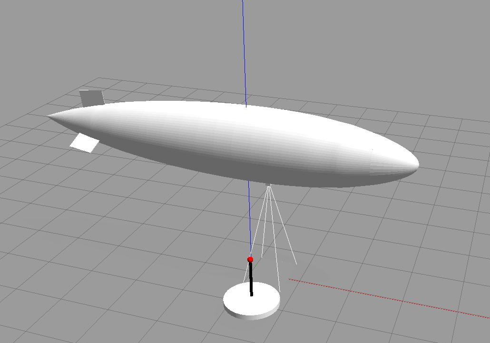

<<<<<<< HEAD
# airship_controler
### Feature: Integração com Gym para Aprendizado por Reforço

Esta feature adiciona um ambiente compatível com o Gym, permitindo o treinamento de modelos de aprendizado por reforço utilizando o simulador do dirigível no ROS2/Gazebo. O ambiente segue a interface padrão do OpenAI Gym, facilitando a integração com algoritmos de RL populares.

**Principais funcionalidades:**
- Interface Gym customizada para controle do dirigível.
- Observações e recompensas configuráveis.
- Suporte a diferentes algoritmos de aprendizado por reforço.
- Scripts de exemplo para treinamento e avaliação.

**Como usar:**
1. Instale as dependências necessárias (`gym`, `stable-baselines3`, etc.).
2. Execute o ambiente com seu agente de RL preferido.
3. Ajuste os parâmetros de observação e recompensa conforme necessário.

Consulte a documentação na pasta `gym_env/` para mais detalhes e exemplos de uso.
=======
# Dirigible Control


Controlador autônomo para um dirigível simulado no Gazebo com ROS 2.

## Visão Geral

Este pacote ROS 2 em sua fase inicial de desenvolvimento permite controlar um dirigível em um ambiente simulado no Gazebo. Inclui modelos de mundo, modelos de dirigível com câmera, marca de pouso e scripts para inicialização automática do ambiente.


### Referência

Este projeto foi desenvolvido com base no artigo:

> AZINHEIRA, José R. et al. *Visual servo control for the hovering of all outdoor robotic airship. In: Proceedings 2002 IEEE International Conference on Robotics and Automation* (Cat. No. 02CH37292). IEEE, 2002. p. 2787-2792. [Link para o artigo](https://ieeexplore.ieee.org/abstract/document/1013654?casa_token=V1RESjdL1GAAAAAA:TQov1rpwm6VU6awHbmAbO2H-f5PPjaHkgFZte1Lt2ZEtjKoqWWnyUNWwqw-qAjynVQGcn-HJJ2iA)

Abaixo, uma imagem ilustrativa do artigo:


## Estrutura do Projeto

- `dirigible_control/`: Código fonte do pacote ROS 2.
  - `dirigible_controller.py`: Nó principal de controle do dirigível.
  - `launch/dirigible.launch.py`: Script de lançamento que inicia o Gazebo com o mundo e o nó de controle.
  - `models/`: Modelos SDF do dirigível e marca de pouso.
  - `worlds/empty.world`: Mundo do Gazebo vazio incluindo os modelos posicionados.
  - `test/`: Testes de lint e copyright.
- `package.xml`, `setup.py`, `setup.cfg`: Arquivos de configuração do pacote.

## Como Usar

1. **Instale as dependências** do ROS 2 Humble e do Gazebo Classic.
2. **Construa o workspace**:
   ```sh
   colcon build
   ```
3. **Fonteie o ambiente**:
   ```sh
   source install/setup.bash
   ```
4. **Execute o launch**:
   ```sh
   ros2 launch dirigible_control dirigible.launch.py
   ```

## Funcionalidades

- Inicialização automática de mundo no Gazebo, incluindo os modelos sdf do Dirigivel e sua Base para Pouso.
- Controle do dirigível via tópico `/cmd_vel` [Em desenvolvimento].
- Simulação de câmera embarcada.
- Marca de pouso para navegação.

## Autor

- Jonas Moreira (jonas.barbosa@ufam.edu.br)

## Licença

Veja o arquivo [package.xml](dirigible_control/package.xml) para detalhes de licença.
>>>>>>> origin/main
